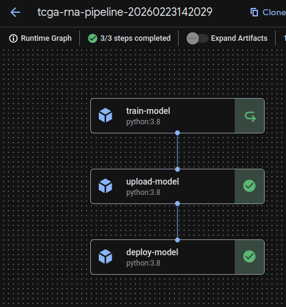

## Deployment

This repository proposes an approach to deploy a very simple machine learning model trained on omics data.  The deployment purpose is to demonstrate the deployment feasability using Vertex AI.

## Project Structure
- `scripts/explore_rna_data.py` — exploratory analysis, PCA/t-SNE visualization, ANOVA, pathway enrichment
- `scripts/train_model.py` — trains the random forest on PCA features and saves the model

### Prerequisites
- gcloud CLI installed and authenticated
- Docker

The pipeline consists of 3 steps:
1. **train_model** — PCA dimensionality reduction + Random Forest training on TCGA liver RNA data
2. **upload_model** — registers the model in Vertex AI Model Registry
3. **deploy_model** — deploys to a Vertex AI endpoint for online prediction

## Results
- Balanced accuracy on the test set: 0.91